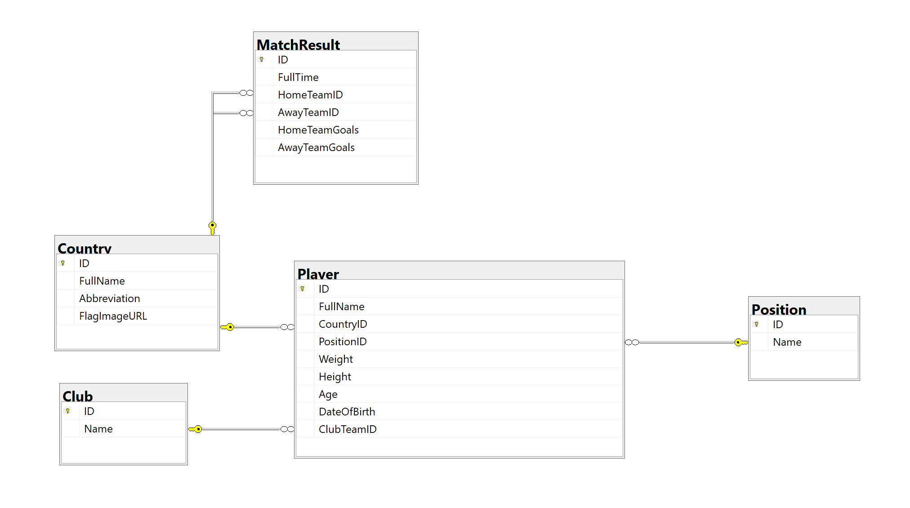
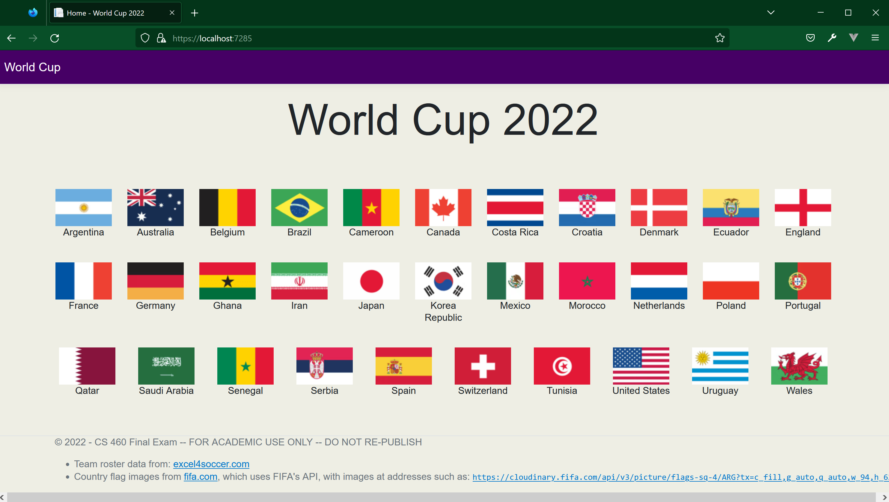

# CS 460 Final Programming Exam Fall 2022
This is an initial project that you can use to build a database and test everything out prior to the actual exam.  Just before the exam I will push changes to this repo.  That will be your starting code.

## This is the starting data model

## Home page
This is what you should see when you get it running.  Some of the images are in .avif format, which Microsoft Edge does not support.  Use a different browser.

