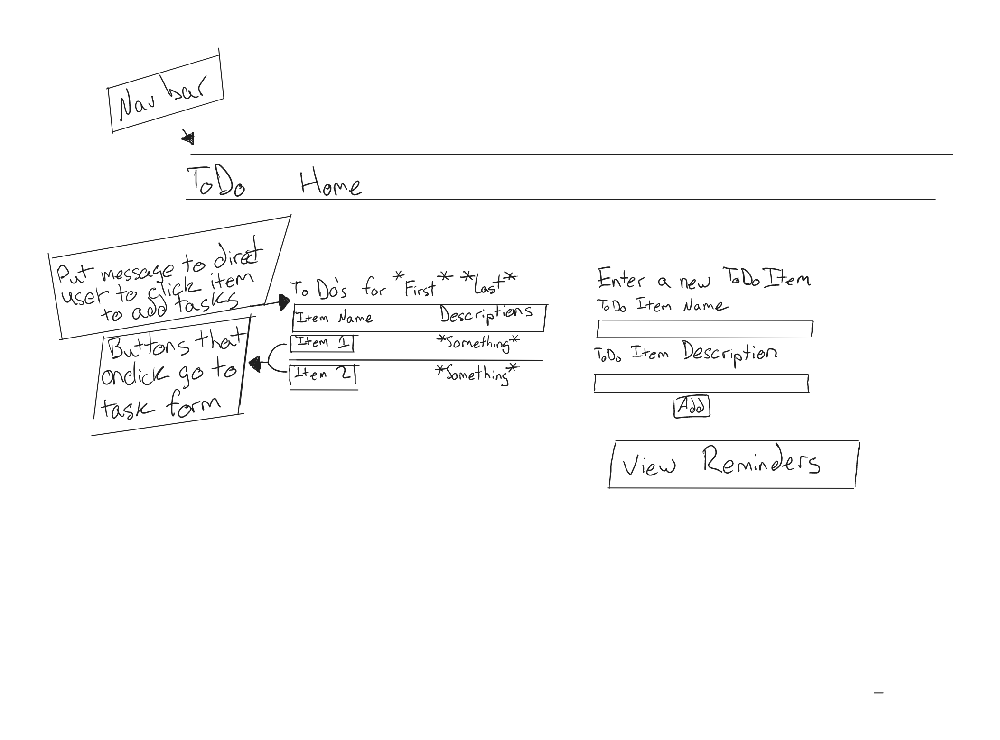

## ID: **3**

## Title
    As a user I want to add tasks to items already in the system and then be reminded of them so I won't forget to do all the tasks I need to do.

## Description

A user goes to "their" page and sees an option to pick an item from their list of ToDos. They can then add a task to that item, with information pertaining to the task that needs to be done. 

The items they need to enter are:

1. The task name
2. A description for the task
3. When it needs to be completed the first time
4. How frequently this task needs to be completed in number of days, ie: ***Complete again in 5 days***

Once a user has one or more tasks set, then an option to look at upcoming tasks should appear. This could be present to begin with, but if there's no tasks then that needs to be handled nicely. When a user selects this option, they will be directed to a new page that lists the following:

1. The title of the item
2. The tasks that exist for that item, in ascending order by how many days until they need to be completed
3. The task description

Reasons for failure and what to do:

1. A user fails to provide one or more pieces of required info. Enforce that each of these exist by the time the user submits a task.
2. Not really a failure, but if a user has no items, they shouldn't see an option to add tasks. This functionality should only exist when the list of items has **one or more** items in it.
3. As with failure 2, if an item has no tasks, and the option to look at upcoming tasks is selectable, then the user should be shown a message stating they have no upcoming tasks.

## Acceptance Criteria

    Given I am on the page at /user/sandra%20hart
    And I have a list of ToDo Items
    Then I should see an option to pick an item to add tasks to
 

    Given I am on the page at /user/sandra%20hart
    And I have no items in my ToDo list
    Then I should not see an option to pick items
    And I should not see an option to view upcoming tasks
 

    Given I have picked an item to add tasks to
    Then I should see a page with a form where I can enter the task information
 

    Given I have picked an item to add tasks to
    And I fill out the form with valid information
    And I submit the form
    Then I should be informed that the task has been added
    And I should see which item it was added to
 

    Given I have picked an item to add tasks to
    And I fill out the form with invalid information
    And I submit the form
    Then I should be notified that the info is wrong
    And I should not see the new task be created
 

    Given I am on the page at /user/sandra%20hart
    And I have added tasks to any items
    Then I should see an option to view upcoming reminders
 

    Given I am on the page at /user/sandra%20hart
    And I have not added tasks to any items
    And I see an option to view upcoming reminders
    Then I should be notified that no reminders exist for any tasks

## Assumptions/Preconditions

User is on their page and can see the ToDo Items list.

## Dependencies: **ID 2**

## Effort Points: **TBD**

## Owner: **Justin Davis**

## Git Feature Branch: ***Rmnd-US-3-task***

## Modeling and Other Documents
**Basic look of the UserPage with new additions**

**Basic look of the TaskForm page with Form for entering task details**

**Basic look of the ViewTasks page**

## Tasks

1. Adjust ToDo table to have buttons for the **Item Name** with a message to prompt users to click them in order to add tasks.
2. Add button to User page for *View Reminders*.
3. Add a Unit test class with test methods to test adding a task to an item
4. Add a Unit test class with test methods to test getting the ToDo items and their tasks
5. Create a new view page for the Task form.
6. Create a new view page for the View Tasks option.
7. Implement view functionality for Task form.
8. Manually test the interface and funtionality.